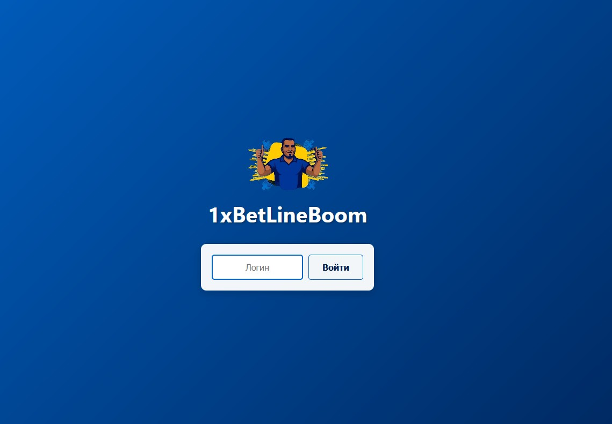
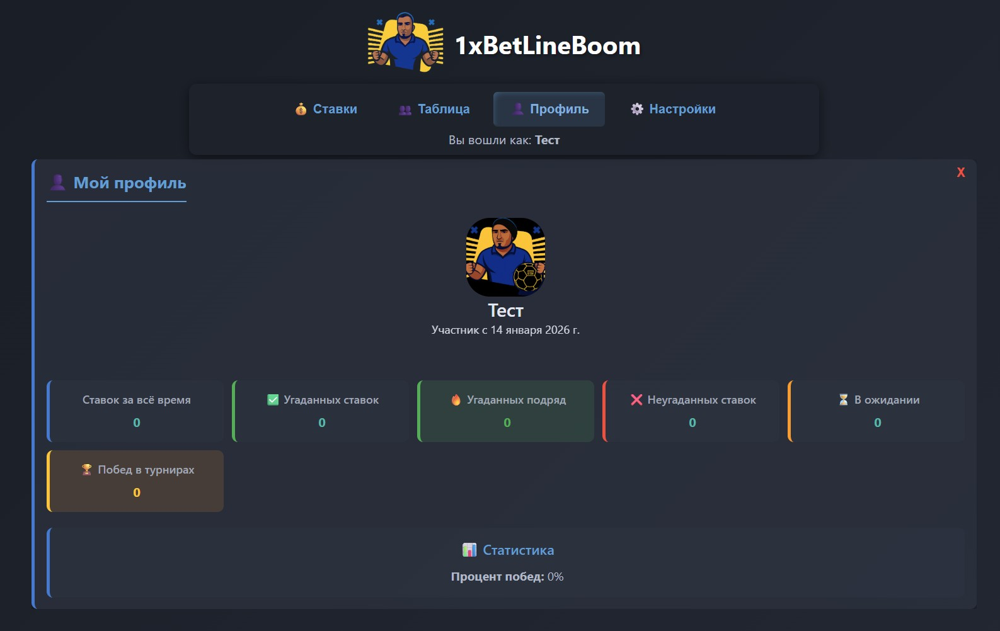
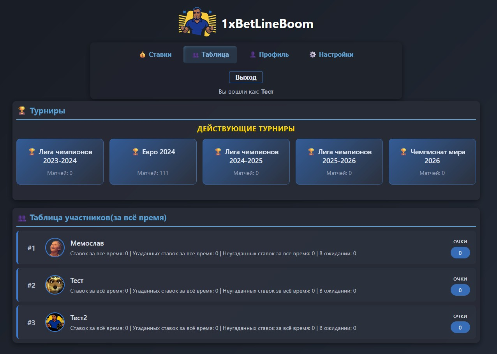
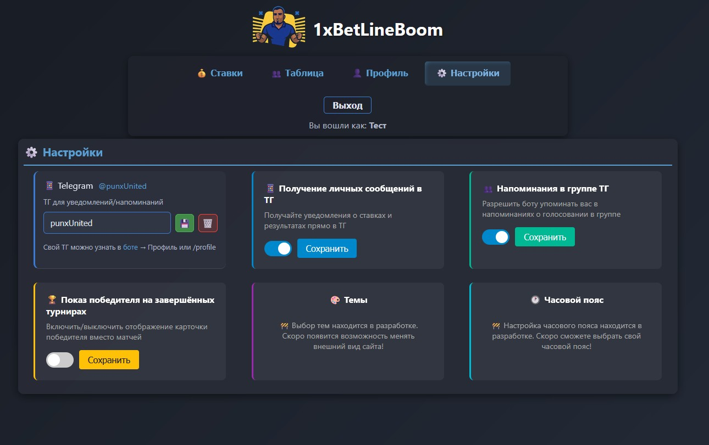

# 1xBetLineBoom


## 📱 Описание

\*\*1xПриложение будет доступно по адресу `http://localhost:3000`

## 📝 Как использовать

### Базовое использование

1. **Вход** — введите своё имя и нажмите "Начать"
2. **Просмотр турниров** — выберите турнир в разделе "📅 Турниры" (слева вверху)
3. **Просмотр матчей** — матчи выбранного турнира появятся в разделе "⚽ Матчи"
4. **Фильтр по турам** — если есть несколько туров, выберите нужный тур для фильтра
5. **Ставки на матчи** — нажмите на одну из кнопок ставки (победа 1 или победа 2)
6. **Финальные ставки** — для финальных матчей выберите результат и финальные параметры
7. **Отслеживание ставок** — смотрите свои ставки в разделе "💰 Мои ставки" (справа)
8. **Рейтинг** — смотрите рейтинг всех участников во вкладке "👥 Участники"

### Быстрые советы

- **Импорт матчей** — используйте CSV файлы с форматом: "Команда1 vs Команда2" или "Команда1-Команда2"
- **Финальные параметры** — заполняйте их только для финальных матчей
- **Случайная ставка** — нажмите "🎲 Мне повезет" для автоматической ставки на все матчи тура
- **Мобильный вид** — приложение полностью адаптировано для мобильных устройств
- **Настройки** — в разделе "⚙️ Настройки" можно изменить аватар и посмотреть админ-панель

## 💯 Система очковLineBoom\*\* — это веб-приложение для управления спортивными ставками и турнирами среди друзей. Приложение позволяет создавать турниры, просматривать матчи, делать ставки и отслеживать результаты в реальном времени.

## ✨ Основные возможности

- 🎮 **Управление турнирами** — создание и отслеживание спортивных турниров
- ⚽ **Просмотр матчей** — список матчей с фильтром по турам и сортировкой по дате
- 💰 **Система ставок** — ставьте на результаты матчей и финальные параметры
- 🏆 **Финальные ставки** — расширенная система ставок на финалы с параметрами:
  - 📊 Точный счет
  - 🟨 Желтые карточки
  - 🟥 Красные карточки
  - ⚽ Угловые и пенальти
  - ⏱️ Дополнительное время
- 👥 **Участники** — рейтинг всех участников с системой очков
- 👤 **Личный профиль** — управление профилем и просмотр истории ставок
- ⚙️ **Настройки** — персональные настройки приложения
- 👨‍💼 **Администрирование** — полное управление пользователями, турнирами и данными
- 🔧 **Orphaned data management** — автоматическая очистка удаленных данных из БД
- 📥 **Импорт матчей** — импорт матчей из CSV с выбором разделителя ("\\", "-", "vs")

## 🛠️ Технологический стек

- **Frontend**: HTML5, CSS3, Vanilla JavaScript
- **Backend**: Node.js, Express.js
- **Database**: SQLite3 (better-sqlite3)
- **Дизайн**: Адаптивный, современный UI с Champions League цветовой схемой

## 🎨 Цветовая схема

- **Основной цвет**: #0066CC (UEFA Champions League Blue)
- **Темный цвет**: #001F50 (Dark Blue)
- **Акцент**: #FFB81C (Gold)

## 📸 Скриншоты

### Экран входа



### Интерфейс приложения


### Профиль участника



### Таблица лидеров



### Окно настроек



## 🚀 Быстрый старт

### Требования

- Node.js 14+
- npm или yarn

### Установка

```bash
# Клонируем репозиторий
git clone https://github.com/Vidrimers/1xBetLineBoom.git
cd 1xBetLineBoom

# Устанавливаем зависимости
npm install

# Запускаем сервер
npm start
```

Приложение будет доступно по адресу `http://localhost:3000`

## � Система очков

### Обычные матчи

| Действие                   | Очки   |
| -------------------------- | ------ |
| Правильно угадан результат | 1 очко |

### Финальные матчи

| Действие                             | Очки   |
| ------------------------------------ | ------ |
| Правильно угадан результат           | 3 очка |
| Каждый правильный финальный параметр | 2 очка |

### Финальные параметры

За каждый правильно угаданный параметр в финале дается **2 очка**:

- 📊 Точный счет
- 🟨 Желтые карточки (за каждую)
- 🟥 Красные карточки (за каждую)
- ⚽ Угловые (за каждый)
- ⚽ Пенальти в игре (за каждый)
- ⏱️ Дополнительное время
- 🏆 Пенальти в серии (за каждый)

**Пример:** Если в финале вы угадаете результат (3) + точный счет (2) + 5 угловых (2×5=10) = **15 очков**

## 📊 Сортировка и фильтрация

- **Турниры** — сортируются по дате начала (от ближайших к дальним)
- **Матчи** — можно фильтровать по турам (для турниров с несколькими турами)
- **Таблица лидеров** — автоматически сортируется по количеству очков (от больше к меньше)

## 👨‍💼 Администратор

Если вы администратор (установлены права в `.env`), у вас появятся дополнительные возможности:

### В главном интерфейсе:

- ➕ **Добавить турнир** — создание новых турниров
- ➕ **Добавить матч** — создание матчей вручную (видно при выборе турнира)
- � **Импорт матчей** — импорт матчей из CSV-файла с выбором разделителя

### В настройках (админ-панель):

- 🗑️ **Очистить логи** — удалить логи приложения
- 📋 **Открыть логи** — просмотр логов в отдельном окне
- 💾 **Бэкап БД** — создать резервную копию базы данных
- 🛡️ **Модераторы** — управление правами модераторов
- 🏆 **Награды** — управление наградами за турниры
- 🔍 **Проверить orphaned** — проверка и очистка удаленных данных из БД
- 👥 **Пользователи** — управление администраторами системы

## 🔧 API Endpoints

### Основные endpoints

- `POST /api/user` — создание/получение пользователя
- `GET /api/events` — список активных турниров (сортированы по дате начала)
- `GET /api/events/:eventId/matches` — матчи турнира
- `POST /api/bet` — создание ставки на обычный матч
- `POST /api/final-bet` — создание финальной ставки с параметрами
- `GET /api/my-bets` — мои ставки с статусами
- `GET /api/participants` — список участников с рейтингом и очками
- `GET /api/user/:userId/profile` — профиль пользователя с статистикой

### Администраторские endpoints

- `POST /api/admin/create-event` — создание турнира
- `POST /api/admin/create-match` — создание матча
- `POST /api/admin/final-parameters` — установка финальных параметров
- `GET /api/admin/orphaned-data?username=admin_name` — проверка orphaned данных
- `POST /api/admin/cleanup-orphaned-data` — удаление orphaned данных
- `POST /api/admin/set-final-parameters` — установка результатов финальных параметров

## 📦 Структура проекта

```
1xBetLineBoom/
├── index.html          # Главная страница
├── server.js          # Express сервер
├── package.json       # Зависимости
├── css/
│   └── style.css      # Стили приложения
├── js/
│   ├── index.js       # Основной скрипт
│   └── dict.js        # Словари
├── img/
│   ├── logo_*.png     # Логотипы
│   ├── logo_anim.gif  # Анимированный логотип
│   └── screens/       # Скриншоты
└── temp/             # Временные файлы
```

## Управление Orphaned Данными

**Orphaned данные** — это турниры, матчи, ставки и другие данные, которые были удалены со своего сайта, но еще остались в БД (обычно из-за ошибок синхронизации).

### Как проверить orphaned данные?

#### Через интерфейс (для администраторов):

1. Откройте "Настройки"
2. Найдите кнопку "Проверить orphaned" в админ-панели
3. Система покажет статистику orphaned данных
4. При обнаружении данных вы сможете их удалить

#### Через терминал:

```bash
# Проверить orphaned данные
node check-orphaned-data.js

# Очистить orphaned данные
node cleanup-orphaned-data.js
```

### API Endpoints для orphaned данных

- `GET /api/admin/orphaned-data?username=admin_name` — получить список orphaned данных
- `POST /api/admin/cleanup-orphaned-data` — удалить orphaned данные

### Что проверяет система?

- Матчи без события — матчи, чье событие удалено
- Ставки на удаленные матчи — ставки на несуществующие матчи
- Финальные ставки — ставки на финалы удаленных матчей
- Напоминания — уведомления о удаленных матчах
- Награды — награды за удаленные турниры
- Параметры финала — параметры удаленных матчей

## 📄 Лицензия

Этот проект создан для развлечения и обучения.

## 👨‍💻 Автор

**Vidrimers** — разработчик проекта

## 🤝 Способы использования

### Для друзей и компании

Приложение идеально подходит для создания дружеских лиг и турниров:

- **Euro 2024, Copa America** — международные турниры
- **Лига Чемпионов** — клубные турниры
- **Чемпионаты страны** — национальные лиги
- **Дружеские матчи** — любые спортивные события

### Для модераторов

Модераторы могут управлять ставками и следить за честностью игры:

- Просмотр всех ставок пользователей
- Контроль результатов матчей
- Управление наградами

---

**Развлекайтесь и делайте удачные ставки!** 🎯💰⚽

## 🐛 Известные проблемы и решения

Если матчи не отображаются корректно:

1. Проверьте, что турнир выбран в левой колонке
2. Перезагрузите страницу (F5 или Ctrl+R)
3. Проверьте консоль браузера на ошибки (F12)

Если ставка не принимается:

1. Убедитесь, что матч еще не начался
2. Проверьте, что выбран правильный результат
3. Попробуйте еще раз через несколько секунд

## 📚 Дополнительные материалы

- **Логи приложения** — доступны через админ-панель (кнопка "Открыть логи")
- **Резервные копии БД** — создаются в папке `backups/`
- **Скрипты управления** — находятся в корне проекта (`check-awards.js`, `cleanup.js` и т.д.)
